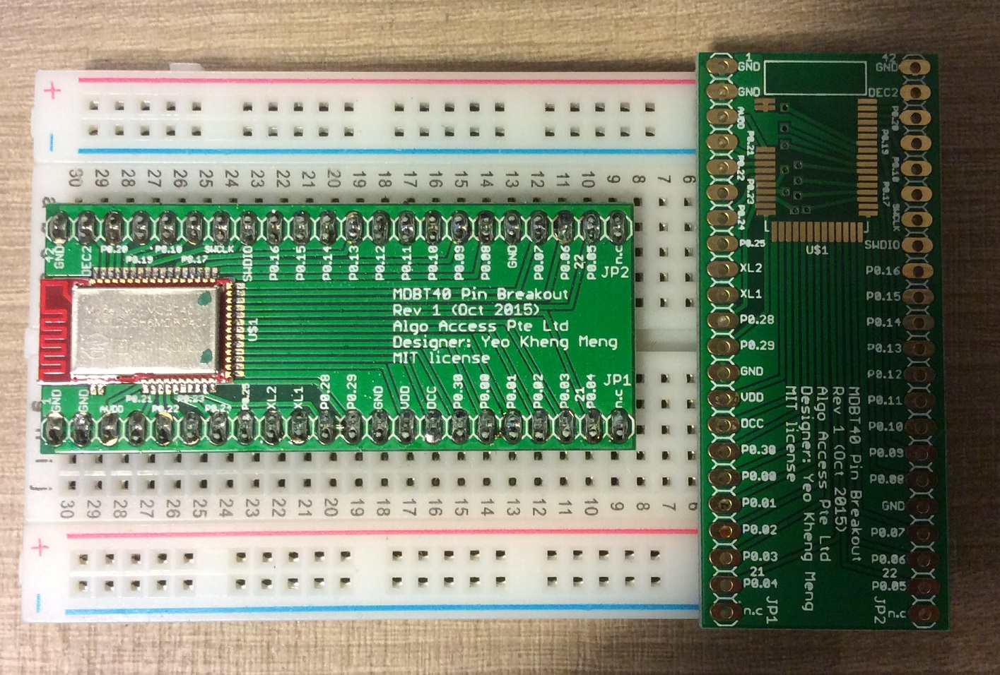
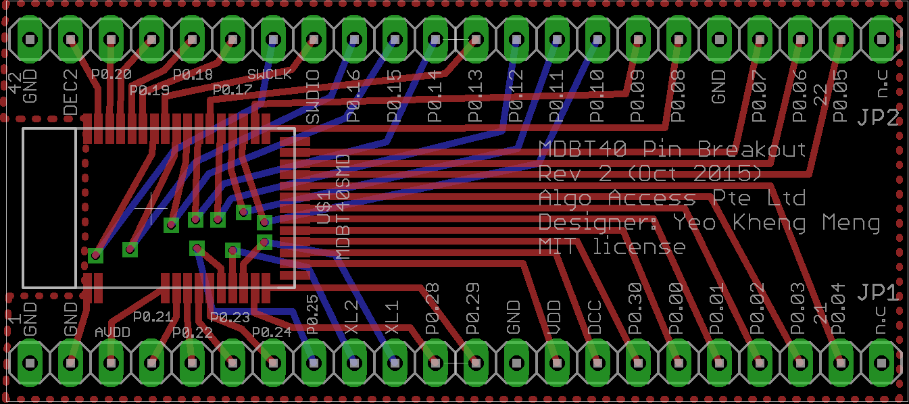
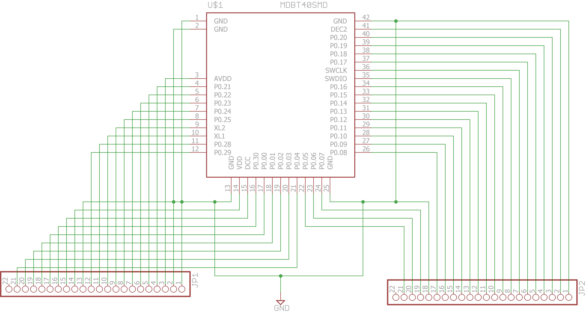

# pcb-breakout-mdbt40
Pin breakout of the Raytac MDBT40 module based on Nordic NRF51 to through-hole pin headers for prototyping.

##PCB Design software and addons used

1. Eagle 7.3.0 standard
2. MDBT40 library by [bluzDK](https://github.com/bluzDK/bluzDK) (in repo as MDBT40-v2-bluzDK)

##Images

This is the older revision 1 design. It has an error of the pin header not being directly suitable for the breadboard without some forcing. Corrected in Revision 2.

##Schematic drawings
Images are exported from Eagle at 600dpi.

##Parts required

The MDBT40 module can be bought direct from the manufacturer [Raytac](http://www.raytac.com/)
